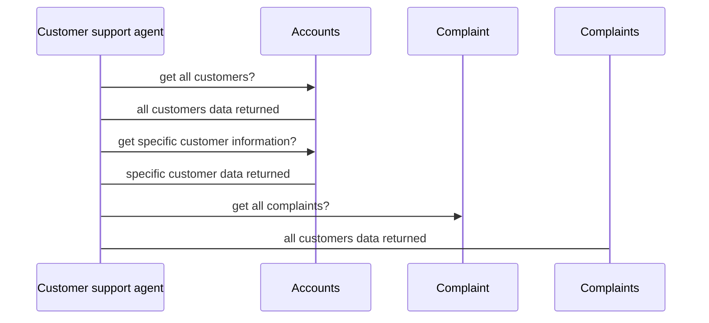

# CIM-Demo

This repo is to apply the microservices architecture with different technologies used.

# Repository content

- Accounts microervice.
- Complaints microservice.
- CIMCommons utility dependency
- ULFF logger utility dependency
- READ.me file

## Technologies used

- Java 8
- Spring Boot
- Spring Data
- H2 in memory database
- RESTful Jackson
- Spring-Kafka integration

## Notes

- The work on this demo is not finished yet.
- Contact me: (mohamed.s.elshall2011@gmail.com)

## Rename a file

You can rename the current file by clicking the file name in the navigation bar or by clicking the **Rename** button in the file explorer.

## Delete a file

You can delete the current file by clicking the **Remove** button in the file explorer. The file will be moved into the **Trash** folder and automatically deleted after 7 days of inactivity.

## Export a file

You can export the current file by clicking **Export to disk** in the menu. You can choose to export the file as plain Markdown, as HTML using a Handlebars template or as a PDF.

## UML diagrams

